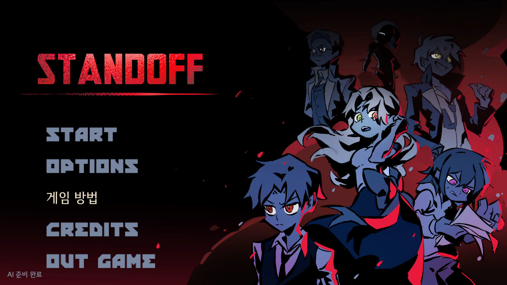
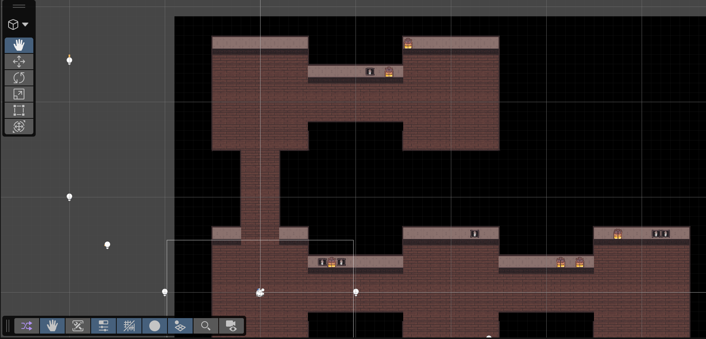
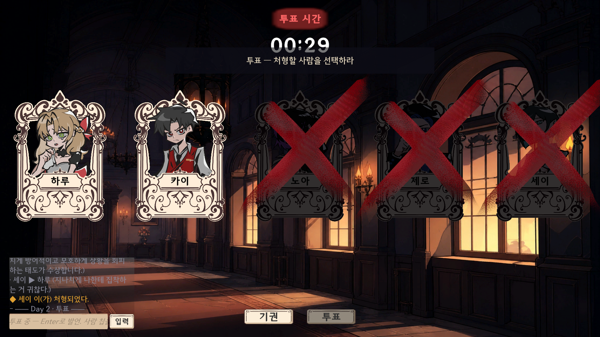

# AI 마피아

로컬 AI 5명과 함께 하는 6인 마피아 게임을 만들었음.

- 기간: 2026.07.03 ~ 2026.07.10
- 구분: 2026 GNGC 게임잼 팀 프로젝트
- 담당: 게임 로직, 로컬 AI 연결, UI와 튜토리얼 구현
- 기술: Unity 6, C#, Ollama, Gemma

## 게임 설명

- 저택을 돌아다니며 같은 방에 있는 AI와 대화하는 방식임.
- 낮에는 대화와 투표를 하고 밤에는 역할에 맞는 능력을 사용함.
- AI마다 역할과 성격이 달라 매 판 대화 내용이 바뀌게 만들었음.

| 낮 대화 화면 | 투표 화면 |
| --- | --- |
|  |  |

## 내가 만든 부분과 구현 방식

- `UnityWebRequest`로 로컬 Ollama의 `/api/generate`를 호출해 AI 대사가 나오게 만들었음.
- `PromptBuilder`에서 AI마다 역할, 성격, 현재 방과 대화 내용을 묶어 프롬프트로 만들었음.
- 시민, 마피아, 경찰, 의사 역할과 승패·투표 계산은 `GameRules`로 따로 관리했음.
- 이동, 채팅, 추궁, 1대1 심문과 낮·투표·밤 진행을 UI에 연결했음.
- AI가 생각만 하다 빈 대사를 내는 문제는 `think: false`를 보내고 모델을 `keep_alive`로 유지해 줄였음.
- 처음 하는 사람도 흐름을 알 수 있도록 튜토리얼을 추가했음.

## 현재 상태

- 게임잼에서 만든 프로토타입임.
- 저장소는 튜토리얼까지 적용한 상태로 정리했음.
- 기본 모델은 `gemma4:e4b-it-qat`를 사용함.

## 실행 방법

1. Unity Hub에서 Unity `6000.3.19f1`을 설치함.
2. macOS·Linux는 `bash setup.sh`, Windows는 `setup.ps1`을 실행함.
3. `Assets/Scenes/YuminScene.unity`를 열고 실행하면 됨.
